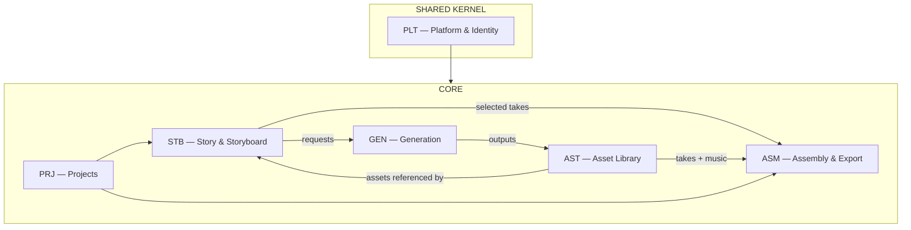

# 02 — Bounded Contexts and Context Map

Canonical decomposition for the **AI Video Director**. Every aggregate and table belongs to exactly one context below.

Six contexts (the v0 template's NLE-oriented TML/MED/AGT/RND/COL/INT set is retired — see `_archive/v0-template/`).

---

## 1. Context map

Value chain: **PRJ** opens a production → **STB** plans script and shots → **GEN** executes model calls → **AST** stores immutable outputs → user selects in **STB** → **ASM** assembles and exports.

---

## 2. Context register

| Code | Context | Type | Detail doc |
|------|---------|------|------------|
| **PLT** | Platform & Identity | Shared kernel | `10-platform-identity.md` |
| **PRJ** | Projects | Core | `11-projects.md` |
| **STB** | Story & Storyboard | Core — **system of record** | `13-storyboard.md` |
| **GEN** | Generation | Core | `14-generation.md` |
| **AST** | Asset Library | Core | `12-asset-library.md` |
| **ASM** | Assembly & Export | Core | `15-assembly-export.md` |
| **ANM** | Animations (Remotion) | Supporting — render engine | `docs/features/animations.md` |

ANM (added 2026-07-23, USER Remotion epic) is a pure render engine: no database tables, no single-writer concerns — GEN's executor invokes it for kind `animation` (engine id `remotion-local`, $0). Templates are parameterized React components; the model/user supplies props, never code.

Collaboration (comments/review) and external publishing are **not contexts yet** — gap register GAP-104/105; Suno handoff lives in `17-integrations.md` as a pattern inside STB/AST, not a separate context.

---

## 3. Ownership (summary)

| Context | Owns | Events (examples) |
|---------|-----------------|---------------------|
| PLT | User, Organization, membership, quotas, audit, config | `plt.OrganizationCreated`, `plt.QuotaExceeded` |
| PRJ | Project, Brief, Format, members, cost rollup | `prj.ProjectCreated`, `prj.CostThresholdReached` |
| STB | Script (versions), Shot, Direction, frame/take selections, Music Brief | `stb.ShotAdded`, `stb.TakeSelected`, `stb.ScriptRevised` |
| GEN | Generation jobs, prompt assembly, model routing, cost records | `gen.GenerationQueued/Completed/Failed` |
| AST | Asset, derivative (thumbnail/poster), org-level Entity & Style Kit, project attachments, uploads | `ast.AssetReady`, `ast.EntityUpdated` |
| ASM | Storyboard Snapshot, Export job, presets, share links | `asm.ExportCompleted`, `asm.ShareLinkCreated` |

Full payloads: `data/41-event-catalog.md`.

---

## 4. Single-writer rules

| Data | Writer | Readers |
|------|--------|---------|
| User / org membership / quotas | PLT | All |
| Project metadata, format, cost rollup | PRJ | All |
| Script, shots, directions, selections, music brief | STB | GEN (context for prompts), ASM (snapshot) |
| Generation records + status + cost | GEN | STB (candidate lists), PRJ (cost rollup), UI |
| Asset bytes, status, entities, style kits, attachments | AST | STB, GEN (references), ASM |
| Snapshots, export jobs, share links | ASM | PRJ (delivery UI) |

Cross-context **writes** go through commands/APIs, not shared-table updates. The critical seam: **STB requests a generation → GEN runs it → output becomes an AST asset → GEN completion links it back as a candidate on the STB shot** (via event/callback, `data/41-event-catalog.md`).

---

## 5. Integration patterns

- **Preferred:** domain events + transactional outbox (`data/41-event-catalog.md`).
- **Sync queries:** read models for storyboard view (shots + candidate counts + thumbnails), generation status, cost meter — `07-api-contracts.md`.
- **External model APIs (Gemini):** only GEN talks to Google. Single chokepoint: routing, retries, rate limits, cost accounting, content-policy error mapping (`14-generation.md`).
- **Music:** STB produces the brief text; GEN renders it with Lyria 3 (default) or the user carries it to Suno and uploads the result to AST (`17-integrations.md` §4, §1).

---

## 6. Database isolation

One schema per context (`plt.*`, `prj.*`, `stb.*`, `gen.*`, `ast.*`, `asm.*`). FKs allowed within a context and to `plt.organization` / `plt.user` / `prj.project` id columns; cross-context references beyond those are by id without FK constraint (documented in `data/40-data-model.md`).

---

## 7. Epic / ledger mapping

Epics use the same codes: `EPIC-STB-001-…` etc. Ledgers live in `libs/plt|prj|stb|gen|ast|asm/REQUIREMENTS.md`.
