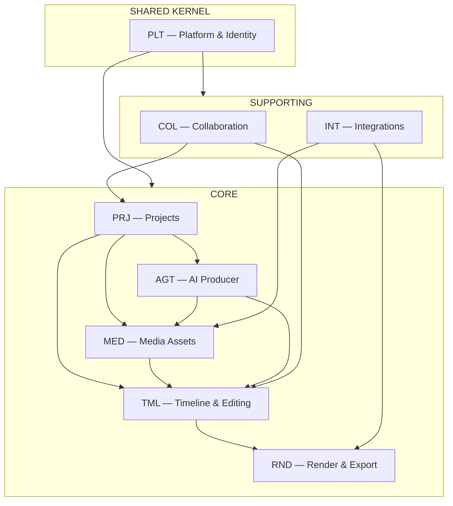

# 02 — Bounded Contexts and Context Map

Canonical decomposition for the **AI Video Producer**. Every aggregate and table belongs to exactly one context below.

---

## 1. Context map

Value chain: **PRJ** opens a production → **MED** supplies assets → **TML** commits edit state → **AGT** proposes changes → **RND** delivers outputs → **COL** / **INT** wrap review and external media.

---

## 2. Context register

| Code | Context | Type | Detail doc |
|------|---------|------|------------|
| **PLT** | Platform & Identity | Shared kernel | `10-platform-identity.md` |
| **PRJ** | Projects | Core | `11-projects.md` |
| **MED** | Media Assets | Core | `12-media-assets.md` |
| **TML** | Timeline & Editing | Core | `13-timeline-editing.md` |
| **AGT** | AI Producer | Core | `14-ai-producer.md` |
| **RND** | Render & Export | Core | `15-render-export.md` |
| **COL** | Collaboration | Supporting | `16-collaboration.md` |
| **INT** | Integrations | Supporting | `17-integrations.md` |

---

## 3. Ownership (summary)

| Context | Owns (examples) | Events (examples) |
|---------|-----------------|---------------------|
| PLT | User, Organization, roles, audit | `UserInvited`, `OrganizationCreated` |
| PRJ | Project, ProjectMember, settings | `ProjectCreated`, `ProjectArchived` |
| MED | MediaAsset, UploadSession, ingest state | `AssetUploaded`, `AssetReady` |
| TML | Sequence, Track, Clip, EditOperation log | `ClipAdded`, `ClipTrimmed` |
| AGT | ProducerSession, Suggestion, Generation | `SuggestionCreated`, `SuggestionAccepted` |
| RND | RenderJob, ExportPreset usage | `RenderJobCompleted` |
| COL | Comment, presence (if in scope) | `CommentAdded` |
| INT | Provider connection, ImportJob | `ImportCompleted` |

Full payloads: `data/41-event-catalog.md`.

---

## 4. Single-writer rules

| Data | Writer | Readers |
|------|--------|---------|
| User / org membership | PLT | All |
| Project metadata | PRJ | TML, MED, AGT, RND |
| MediaAsset bytes & ingest status | MED | TML, RND, AGT |
| Committed sequence state | TML | RND, AGT (read), COL |
| Suggestions (pending) | AGT | TML (on accept) |
| Render outputs | RND | PRJ (delivery UI) |

Cross-context **writes** go through commands/APIs, not shared-table updates.

---

## 5. Integration patterns

- **Preferred:** domain events + outbox (`data/41-event-catalog.md`).
- **Sync queries:** read models for library list, job status — document in `07-api-contracts.md`.
- **External systems:** INT anti-corruption layer only.

---

## 6. Database isolation

One schema or prefix per context (e.g. `plt.*`, `tml.*`). Foreign keys only within context or to `plt.organization` / `plt.user` as decided in `data/40-data-model.md`.

---

## 7. Epic / ledger mapping

| V-model area code | Typical context |
|-------------------|-----------------|
| `PRJ`, `MED`, `TML`, `AGT`, `RND`, `PLT` | Same codes |

Use `EPIC-TML-001-*` style epics for user-visible editor journeys (`req-driven-dev/V-model-loop.md`).
